# 📈 Passive Wealth Reconstruction Engine (PWRE)

[](https://www.python.org/)
[](https://fastapi.tiangolo.com/)
[](https://opensource.org/licenses/MIT)
[](https://docs.docker.com/)

A enterprise-grade, backend-focused financial analytics platform designed to ingest raw Indian and global equity transaction logs, reconstruct historical portfolio wealth over multi-decade horizons, automatically adjust for complex corporate actions, and produce step-by-step mathematically explainable reports for capital gains and portfolio performance.

---

## ⚡ What It Does

The **Passive Wealth Reconstruction Engine (PWRE)** solves a major pain point for long-term equity investors: reconstructing historical transaction ledgers that span across multiple brokers, legacy accounts, and physical-to-demat transitions. It focuses on three core pillars:

### 1. Portfolio & Wealth Reconstruction
* **Decade-scale Ingestion:** Reconstructs purchase and sales transactions over 10, 20, or 30+ year horizons.
* **Cost Basis Tracking:** Implements strict, industry-standard **FIFO (First-In, First-Out)** transaction matching rules to calculate precise cost-bases and holding periods.
* **Unrealized & Realized Gains:** Computes precise Short-Term Capital Gains (STCG) and Long-Term Capital Gains (LTCG) tailored to prevailing tax regulations.

### 2. Automated Corporate Actions Pipeline
Monitors, fetches, and auto-adjusts purchase logs for the full spectrum of corporate events:
* **Stock Splits & Bonus Issues:** Recalculates share counts and adjusts purchase prices backwards in time to maintain accounting parity.
* **Mergers & Demergers:** Processes cost-allocation splits (e.g., separating parent entity cost basis from newly listed spun-off subsidiaries based on official tax-apportionment ratios).
* **Dividends:** Tracks historical yield performance and matches cash inflows against holding balances on the record date.

### 3. Rigorous Explainability & Mathematical Audit
* **No Black Boxes:** Every calculated transaction, split adjustment, or capital gain matches a verifiable audit trail.
* **Step-by-Step Mathematical Logs:** Generates human-readable, JSON-backed logs detailing *exactly* how a specific share cost basis was modified by a corporate event or matched to a sale.
* **Tax Audit Ready:** Exportable reports to verify compliance with Income Tax laws, providing complete transparency for auditors.

---

## 🛠️ Technology Stack

| Layer | Technology | Version | Purpose |
| :--- | :--- | :--- | :--- |
| **Backend Core** | [Python](https://www.python.org/) | `3.11+` | Enterprise financial computations & data ingestion |
| **API Framework** | [FastAPI](https://fastapi.tiangolo.com/) | `0.110.0` | Ultra-fast, async REST API endpoints with auto OpenAPI docs |
| **Database** | [PostgreSQL](https://www.postgresql.org/) | `15` | Relational storage for transaction ledgers & corporate action records |
| **Data Engine** | [Pandas](https://pandas.pydata.org/) | `2.2.1` | Time-series data manipulation, corporate actions matching, and analysis |
| **Numeric Engine**| [NumPy](https://numpy.org/) | `1.26.4` | Optimized, high-performance mathematical operations |
| **Task Queue** | [Celery](https://docs.celeryq.dev/) | `5.3.6` | Out-of-band asynchronous processing for large-scale wealth computations |
| **Cache & Broker**| [Redis](https://redis.io/) | `7.2` | High-speed message queue broker for Celery and endpoint caching |
| **Migrations** | [Alembic](https://alembic.oyrente.com/) | `1.13.1` | Relational database schema version management |
| **Frontend UI** | [Next.js](https://nextjs.org/) | `14+` | Modern web application UI with React components |
| **Visualizations** | [Recharts](https://recharts.org/) | `2+` | Fluid, responsive financial charting and wealth visualizers |
| **Data Sources** | [yfinance](https://github.com/ranaroussi/yfinance) / NSE / BSE | `0.2.37` | Global & Indian stock historical data, corporate events, and quotes |

---

## 🏗️ Architecture Flow

PWRE runs a decoupled, asynchronous, worker-based architecture to keep web responses snappy, delegating heavy mathematical reconstructions to dedicated Celery engines:

### System Overview
```
                               +-------------------+
                               |   Next.js App     |
                               |   (Recharts UI)   |
                               +---------+---------+
                                         |
                                         | REST API / JSON
                                         v
                               +---------+---------+
                               |  FastAPI Backend  |
                               |  (Python / Async) |
                               +----+----+----+----+
                                    |    |    |
         +--------------------------+    |    +--------------------------+
         | Database Query                | Task Trigger                  | External Requests
         v                               v                               v
+--------+----------+          +---------+---------+          +----------+--------+
|    PostgreSQL     |          |   Redis Broker    |          |   Data Feeds      |
|  (Financial DB)   |          |  (Message Queue)  |          | (yfinance/NSE/BSE)|
+-------------------+          +---------+---------+          +-------------------+
                                         |                              ^
                                         | Celery Job                   | Fetch Raw Data
                                         v                              |
                               +---------+---------+                    |
                               |   Celery Worker   +--------------------+
                               | (Pandas / NumPy Engine)                |
                               +----------------------------------------+
```

### Data Pipeline Sequence

```mermaid
sequenceDiagram
    autonumber
    actor User as Investor (UI)
    participant API as FastAPI Backend
    participant DB as PostgreSQL
    participant Redis as Redis Broker
    participant Worker as Celery Math Worker
    participant StockAPI as Yahoo Finance / NSE

    User->>API: Upload Transaction Ledger (CSV/JSON)
    API->>DB: Store Raw Transactions
    API->>Redis: Trigger Reconstruction Job (Job ID)
    API-->>User: Return Async Job Accepted ID
    
    rect rgb(20, 25, 35)
        Note over Redis, Worker: Asynchronous Computing Pipeline
        Redis->>Worker: Consume Wealth Reconstruction Task
        Worker->>DB: Pull Raw Historical Transactions
        Worker->>StockAPI: Fetch Split, Bonus, and Merger histories
        Worker->>Worker: Math Engine: Adjust Ledgers (FIFO, Splits, Dividends)
        Worker->>DB: Save Reconstructed Wealth & Step-by-Step Audit Trail
        Worker->>Redis: Mark Job as SUCCESS
    end
    
    User->>API: Poll Job Status (Job ID)
    API->>DB: Pull Completed Calculations & Audit Trail
    API-->>User: Serve Reconstructed Charts & Math Explanations
```


---

## 🚀 Quick Start Guide

### Prerequisites
Make sure you have the following installed on your machine:
* Python `3.11` or higher
* Docker and Docker Compose
* Git

### Step-by-Step Setup

#### 1. Clone the Repository
```bash
git clone https://github.com/yourusername/passive-wealth-reconstruction-engine.git
cd passive-wealth-reconstruction-engine
```

#### 2. Create the Local Environment Config
Copy the configuration template to establish local environment variables:
```bash
# On Linux / macOS
cp .env.example .env

# On Windows PowerShell
Copy-Item .env.example .env
```
> [!IMPORTANT]
> Open the generated `.env` file and input your actual database names, API keys, and secret configurations.

#### 3. Set Up a Virtual Environment & Dependencies
Choose either `pip` or `Poetry` to initialize your local python development space:

##### Option A: Standard `pip` and Virtualenv
```bash
# Create Virtual Environment
python -m venv .venv

# Activate Virtual Environment
# On Linux/macOS:
source .venv/bin/activate
# On Windows PowerShell:
.venv\Scripts\Activate.ps1

# Install Dependencies
pip install -r requirements.txt
```

##### Option B: `Poetry` Environment Manager
```bash
# Move into the backend directory
cd backend

# Install poetry dependencies (reads pyproject.toml / poetry.lock)
poetry install

# Enter virtualenv shell
poetry shell
```

#### 4. Spin Up Infrastructure Services (PostgreSQL & Redis)
Use Docker Compose to run the database and cache in the background:
```bash
docker-compose up -d
```
You can verify the running containers using `docker ps`.

#### 5. Run Database Migrations
Initialize your database schemas using Alembic:
```bash
# Ensure you are in the directory containing alembic.ini (e.g. ./backend)
cd backend
alembic upgrade head
```

#### 6. Start the API Server
Launch the FastAPI development environment using Uvicorn:
```bash
uvicorn app.main:app --reload --host 127.0.0.1 --port 8000
```
Your interactive API documentation will now be available at [http://127.0.0.1:8000/docs](http://127.0.0.1:8000/docs).

#### 7. Start the Celery Worker
In a new terminal window (with the python virtual environment activated), start the background worker:
```bash
celery -A app.tasks.worker worker --loglevel=info
```

---

## 🤝 Contributing

Contributions make the open-source community an amazing place to learn, inspire, and create. Any contributions you make are **greatly appreciated**.

1. Fork the Project
2. Create your Feature Branch (`git checkout -b feature/AmazingFeature`)
3. Commit your Changes (`git commit -m 'Add some AmazingFeature'`)
4. Push to the Branch (`git push origin feature/AmazingFeature`)
5. Open a Pull Request

---

## 📄 License

Distributed under the **MIT License**. See `LICENSE` for more information.

---

*Disclaimer: The Passive Wealth Reconstruction Engine is an analytical calculation tool and does not constitute official financial, investment, or tax advice.*
